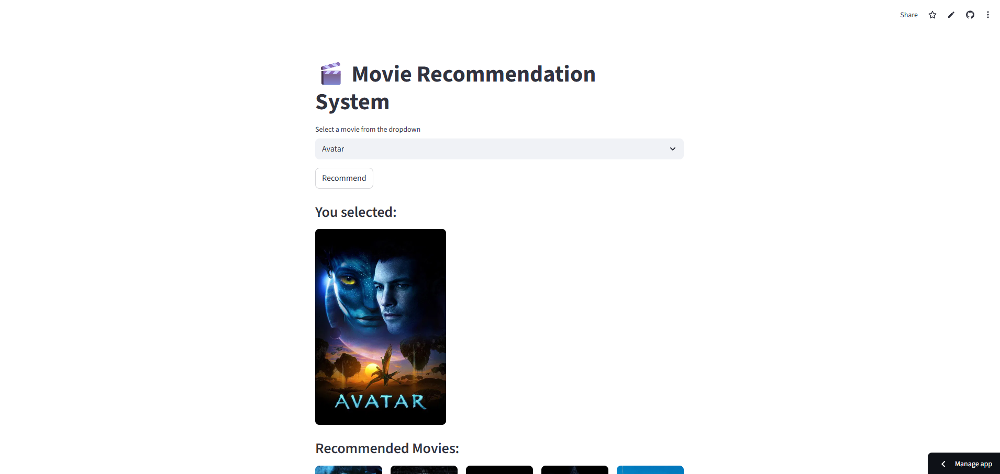
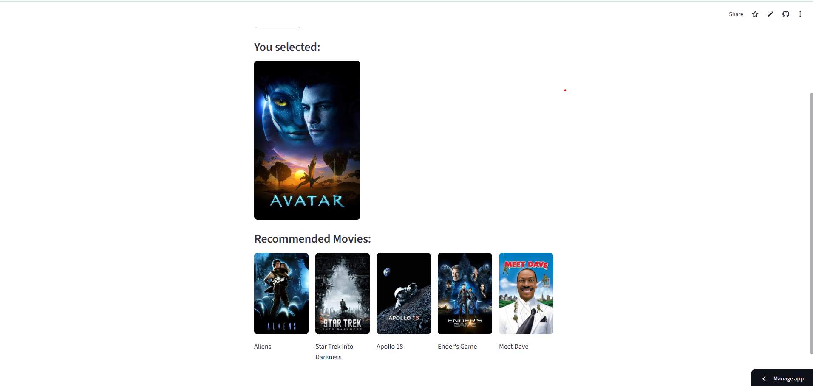

# 🎥 Movie Recommendation System

A **content-based movie recommendation engine** that suggests films similar to your favorites by analyzing content features like plot, genres, cast, and crew.




---

## 🎬 Overview

This project builds an intelligent movie recommendation system using **TF-IDF Vectorization** and **Cosine Similarity**.  
It analyzes rich movie metadata (overview, cast, crew, genres, keywords) to find titles that share similar themes and tone.  
Recommendations are served through a responsive **Streamlit** interface, showing the selected movie and its top-5 similar titles with posters fetched dynamically via **The Movie Database (TMDb) API**.

> 🔗 **Live Demo:** [Movie Recommender App](https://anuragindora-movie-recommendation-system-app-wtc1rn.streamlit.app/)

---

## ✨ Key Features

- 🎯 **Content-Based Filtering** — Suggests movies using TF-IDF text vectorization and cosine similarity  
- 🧠 **Smart Similarity Search** — Finds related titles using precomputed similarity scores  
- 🖼️ **Dynamic Poster Integration** — Fetches real-time posters via TMDb API  
- ⚡ **Fast & Lightweight** — Optimized with compressed `.pkl` (or `.npz`) files for reduced size and faster loading  
- 🧩 **Interactive UI** — Streamlit app with clear layout: selected movie + recommendations  
- 🔒 **Offline Friendly** — Uses local pickled data for instant results

---

## 🛠️ Technology Stack

- **Python 3.x** – Core programming language  
- **Pandas / NumPy** – Data processing and handling  
- **Scikit-learn** – TF-IDF Vectorization and Cosine Similarity  
- **NLTK** – Text preprocessing  
- **Streamlit** – Web-based user interface  
- **Requests** – API calls to TMDb  
- **Pickle** – Data and model serialization  
- **SciPy Sparse Matrices** – Memory-efficient similarity storage  

---

## 📋 Prerequisites

Before running the app, make sure you have:

- Python 3.x installed  
- A valid [TMDb API key](https://www.themoviedb.org/)  
- All required dependencies installed (listed below)

---

## 📦 Installation

1. **Clone the repository**
   ```bash
   git clone https://github.com/AnuragIndora/Movie-Recommendation-System.git
   cd Movie-Recommendation-System
   ```

2. **Install dependencies**

   ```bash
   pip install -r requirements.txt
   ```

3. **Set up your TMDb API key**
   You can either:

   * Add it directly in `app.py` (for testing), or
   * Store it securely in a `.env` file:

     ```
     TMDB_API_KEY=your_api_key_here
     ```

4. **Add the preprocessed data files**
   Ensure `movie_dict.pkl` and `similarity.pkl` (or compressed `.npz` version) are in the project directory.

   > ⚠️ The `similarity.pkl` file is large and not included in GitHub due to file size limits.
   > We can regenerate it using `movie_recommend_system_2.py`.

---

## 🚀 Usage

1. Run the Streamlit app:

   ```bash
   streamlit run app.py
   ```

2. Open your browser at `http://localhost:8501`

3. Select a movie from the dropdown and click **Recommend**

4. View:

   * Row 1 → “You selected” text
   * Row 2 → Poster of the selected movie
   * Row 3 → “Recommended Movies” text
   * Row 4 → Posters of top-5 recommended movies

---

## 🗂️ Project Structure

```
Movie-Recommendation-System/
├── app.py                      # Streamlit app (main interface)
├── movie_recommend_system_2.py  # Script to generate similarity matrix
├── movie_dict.pkl               # Movie data dictionary
├── similarity.pkl / similarity_compressed.npz  # Precomputed similarity data
├── requirements.txt             # Dependencies
├── Pictures/                    # UI screenshots
├── MovieData1/                  # Raw datasets
├── .env                         # Optional: API key storage
└── README.md                    # Project documentation
```

---

## 🔍 How It Works

1. **Data Preprocessing**

   * Cleans and merges metadata (overview, cast, crew, genres)
   * Uses NLP to tokenize, stem, and vectorize text
   * Builds TF-IDF representations for content similarity

2. **Similarity Computation**

   * Calculates cosine similarity between TF-IDF vectors
   * Saves results in a precomputed matrix for quick access
   * Uses sparse matrix compression to reduce file size

3. **Recommendation**

   * Retrieves movies most similar to the selected one
   * Fetches their posters via TMDb API
   * Displays them in a clean Streamlit layout

---

## 🧩 Core Functions

```python
def fetch_poster(movie_id):
    """Fetches the poster of a movie from TMDb API."""
    # Uses requests to retrieve poster_path and builds full URL.

def recommend_movie(movie_title):
    """Finds top 5 similar movies using precomputed similarity matrix."""
    # Returns movie titles and poster URLs.
```

---

## 🌟 Future Enhancements

* 🔐 User-based and hybrid recommendation models
* 🤖 Deep learning embeddings for richer semantic similarity
* 📊 Evaluation framework for recommendation accuracy
* 🌈 Improved responsiveness and mobile layout
* ☁️ Cloud-based storage for compressed data files

---

## 📄 License

This project is licensed under the **MIT License** — see the [LICENSE](LICENSE) file for details.

---

## 🙏 Acknowledgements

* [The Movie Database (TMDb)](https://www.themoviedb.org/) for API access
* [Streamlit](https://streamlit.io/) for intuitive web framework
* [Scikit-learn](https://scikit-learn.org/) for TF-IDF and similarity tools
* [NumPy / Pandas](https://pandas.pydata.org/) for efficient data handling

---

## 👤 Author

**Anurag Indora**
🔗 [GitHub](https://github.com/AnuragIndora)
🌐 [Live App](https://anuragindora-movie-recommendation-system-app-wtc1rn.streamlit.app/)

---

⭐ If you found this project useful, give it a **star** on GitHub!

```
