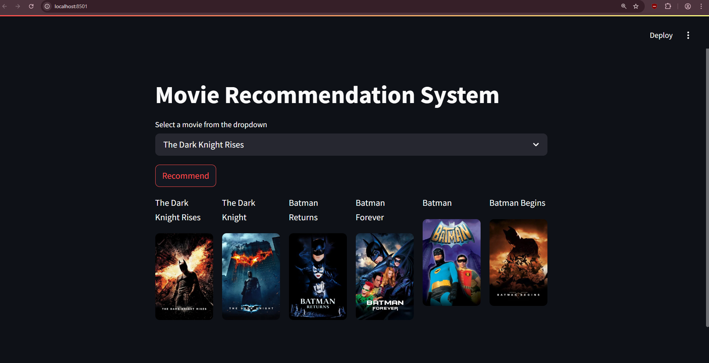

# Movie Recommendation System

A sophisticated content-based movie recommendation engine that suggests films similar to your favorites based on content features like plot, genres, cast, and crew.



## 🎬 Overview

This project implements an intelligent movie recommendation system using **TF-IDF Vectorization** and **Cosine Similarity** algorithms. The system analyzes movie content features including overviews, genres, keywords, cast, and crew to identify similar films. Results are presented through an intuitive **Streamlit** interface that displays recommendations along with movie posters fetched from **The Movie Database (TMDb) API**.

## ✨ Key Features

- **Content-Based Filtering**: Recommends movies by analyzing textual similarity using TF-IDF Vectorization
- **Intelligent Similarity Calculation**: Uses Cosine Similarity to find movies with related themes, genres, and production elements
- **Dynamic Poster Integration**: Fetches and displays movie posters via TMDb API
- **User-Friendly Interface**: Clean Streamlit UI with simple dropdown selection
- **Diverse Recommendations**: Algorithm balances similarity with variety to avoid recommendation bubbles

## 🛠️ Technology Stack

- **Python 3.x**: Core programming language
- **Pandas & NumPy**: Data manipulation and numerical operations
- **Scikit-learn**: TF-IDF Vectorization and Cosine Similarity computation
- **NLTK**: Natural language processing for text analysis
- **Streamlit**: Interactive web application interface
- **Requests**: API integration with TMDb
- **Pickle**: Model serialization and persistence

## 📋 Prerequisites

Before running the project, ensure you have the following installed:

- Python 3.x
- Required libraries (installable via pip)
- TMDb API key

## 📦 Installation

1. Clone the repository:
   ```bash
   git clone https://github.com/AnuragIndora/Movie-Recommendation-System.git
   cd Movie-Recommendation-System
   ```

2. Install required dependencies:
   ```bash
   pip install -r requirements.txt
   ```

3. Create a free account on [The Movie Database (TMDb)](https://www.themoviedb.org/) and obtain an API key

4. (Optional) Create a `.env` file to securely store your API key:
   ```
   TMDB_API_KEY=your_actual_api_key_here
   ```

## 🚀 Usage

1. Ensure you have the preprocessed files (`movie_dict.pkl` and `similarity.pkl`) in your project directory
   > Note: If you don't have the `similarity.pkl` file (which is quite large), you can generate it by running `movie_recommend_system_2.py`

2. Launch the Streamlit application:
   ```bash
   streamlit run app.py
   ```

3. Access the web interface at `http://localhost:8501`

4. Select a movie from the dropdown menu and click **Recommend** to view similar movies with their posters

## 🗂️ Project Structure

```
Movie-Recommendation-System/
├── .gitignore 
├── app.py                  # Main Streamlit application
├── movie_recommend_system_2.py  # Script to generate similarity matrix
├── movie_dict.pkl          # Preprocessed movie data dictionary
├── similarity.pkl          # Precomputed similarity matrix (not uploaded)
├── .env                    # Environment variables (API keys)
├── requirements.txt        # Project dependencies
├── MovieData1/             # Movies Dataset CSV files  
├── Pictures/               # Images folder for UI elements
└── README.md               # Project documentation
```

## 🔍 How It Works

1. **Data Preprocessing**:
   - Movie metadata is cleaned and structured
   - Text features (overview, keywords, etc.) are tokenized and processed
   - TF-IDF vectorization converts text features into numerical vectors

2. **Similarity Computation**:
   - Cosine similarity calculates the similarity between movie vectors
   - Results are stored in a similarity matrix for efficient lookups

3. **Recommendation Generation**:
   - When a user selects a movie, the system finds the most similar movies based on the precomputed similarity scores
   - The top 5 most similar movies are identified and displayed
   - Movie posters are fetched in real-time using the TMDb API

## 🔧 Core Functions

```python
def fetch_poster(movie_id):
    """Fetches movie poster from TMDb API using the movie ID"""
    # Implementation details...

def recommend_movies(movie_title):
    """Generates movie recommendations based on similarity scores"""
    # Implementation details...
```

## 🌟 Future Improvements

- Implement user profiles and personalized recommendations
- Add hybrid filtering combining content-based and collaborative approaches
- Incorporate more advanced NLP techniques for better text analysis
- Create a more comprehensive evaluation framework for recommendation quality
- Develop mobile responsiveness for cross-device compatibility

## 📄 License

This project is licensed under the MIT License - see the LICENSE file for details.

## 🙏 Acknowledgements

- [The Movie Database (TMDb)](https://www.themoviedb.org/) for providing the API
- [Streamlit](https://streamlit.io/) for the interactive web framework
- [Scikit-learn](https://scikit-learn.org/) for the machine learning tools

## 👤 Author

- **Anurag Indora** - [GitHub](https://github.com/AnuragIndora)

---

If you find this project useful, please consider giving it a star ⭐️ on GitHub!